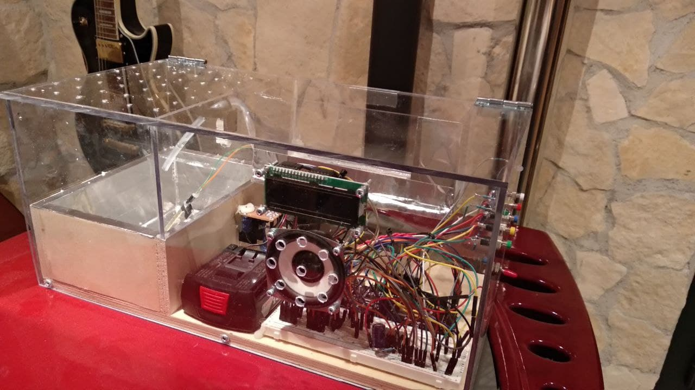
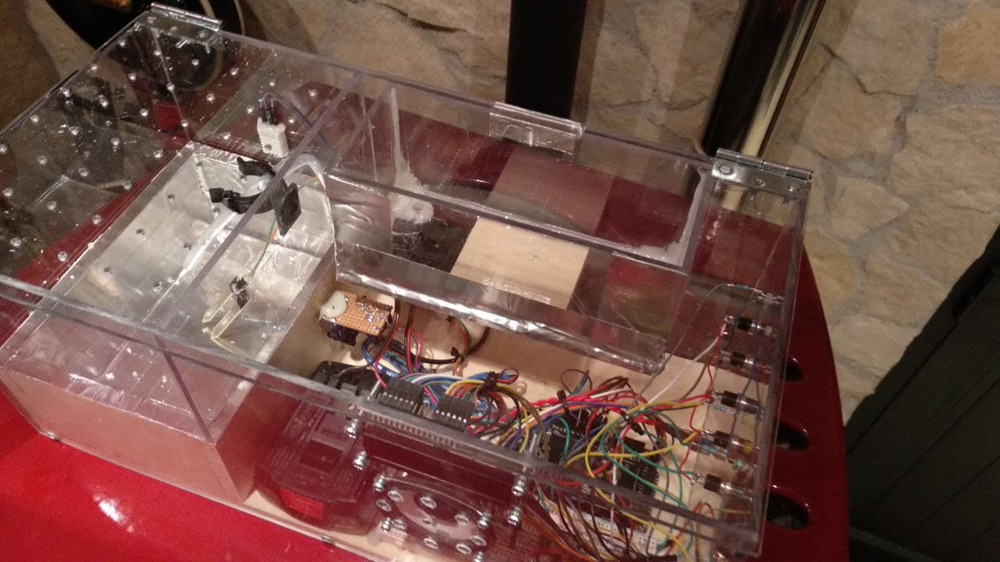
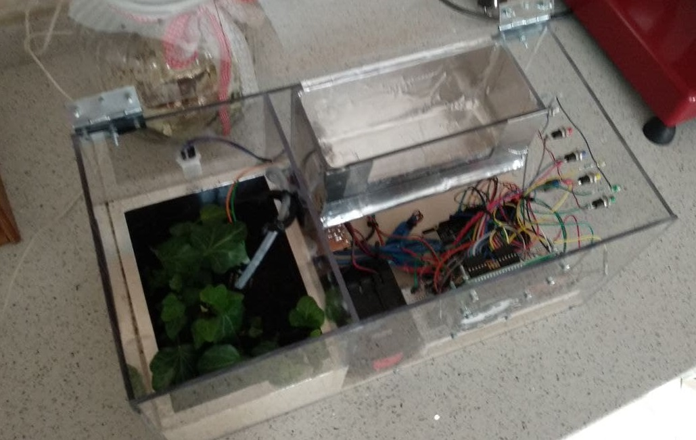

<h1 style="color:#7cb853;">Automated Greenhouse</h1>
I spent more or less 1 month on this project, which I exhibited during my graduation oral exam in 2018.
It was designed to provide an example of how a traditional greenhouse can be automated through the use of a microcontroller like Arduino.

## Description of the project
The greenhouse has two buttons, one dedicated to the activation of the automatic mode, and one for the manual mode. Each user choice will be accompanied by an audio that describes the action being performed, playing it through a speaker. 
In automatic mode, the greenhouse will independently manage the irrigation of the plant according to the humidity of the soil and the air temperature. It will irrigate in shorter time intervals if the ground is dry. 
In manual mode, on the other hand, it is up to the user who uses the greenhouse to decide whether to irrigate or not depending on the soil humidity and the air temperature. To do this, various buttons are available that allow you to irrigate and show the temperature and humidity on the display. 
I want to specify how I managed the soil moisture control sensor (YL-69). The sensor I purchased for this purpose is very sensitive and deteriorates very easily. To make it last much longer I managed it in such a way that it turned on for a few moments just to allow it to calculate the humidity, instead of always keeping it on.

## Graphic Circuit

## Components used for the project
-	Arduino Mega 2560 R3;
-	Breadboard;
-	YL-38 Module for YL-69;
-	Earth humidity sensor (YL-69);
-	Air humidity and temperature sensor (DHT22);
-	3W Speaker;
-	Display LCD 1602A;
-	Audio module DF Player Mini SKU-DFR0299;
-	Micro SD;
-	Water pump DC30B;
-	Module for piloting the pump;
-	Tubes for passage of the water;
-	Standard buttons;
-	10k Potentiometer;
-   1k, 2k and 10k Resistances;
-	Capacitors;
-	Connection cables.

## Sample images

### View of the container and components

### The Automated Greenhouse with a plant in it
